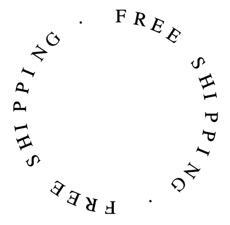

# circular-text
Web component to display text along a circle shape



## How to use

If you are already using npm in your project:
```
npm add @webpunk/circular-text
```

Then import it in your Javascript:
```
import '@webpunk/circular-text';
```

Otherwise, include it from the CDN:
```
<script
    type="module"
    src="https://unpkg.com/browse/@webpunk/circular-text/dist-web/index.js">
</script>
```

Then you'll be able to use it like:
```
<circular-text
    text="FREE SHIPPING · FREE SHIPPING · "
    radius="90">
</circular-text>
```

Where the 2 attributes are:
* text - String to be displayed in the circle shape
* radius - Number that determines the size of the circle

